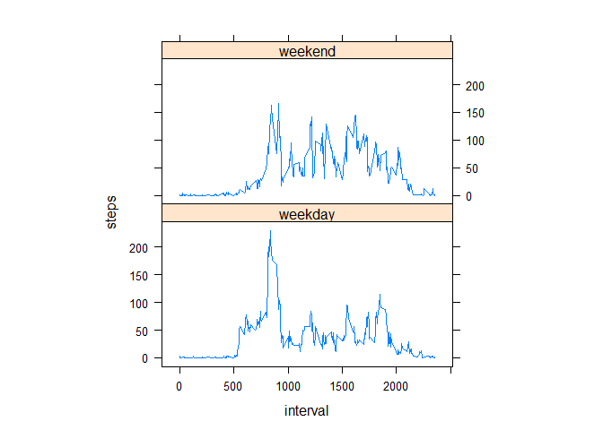

# Reproducible Research: Peer Assessment 1


## Loading and preprocessing the data

1. Loading data
2. Change data types


```r
Rawdata <- read.csv ("activity.csv", header = T, sep = ",", stringsAsFactors = F)
Rawdata$date <- as.Date(Rawdata$date, "%Y-%m-%d")
```

## What is mean total number of steps taken per day?

1. Calculate the total steps taken per day


```r
library (dplyr)
```

```
## 
## Attaching package: 'dplyr'
```

```
## The following objects are masked from 'package:stats':
## 
##     filter, lag
```

```
## The following objects are masked from 'package:base':
## 
##     intersect, setdiff, setequal, union
```

```r
Stat_steps <- Rawdata %>% group_by(date) %>%
          summarize(total_steps = sum(steps, na.rm = T))

head(Stat_steps)
```

```
## Source: local data frame [6 x 2]
## 
##         date total_steps
##       (date)       (int)
## 1 2012-10-01           0
## 2 2012-10-02         126
## 3 2012-10-03       11352
## 4 2012-10-04       12116
## 5 2012-10-05       13294
## 6 2012-10-06       15420
```


2. Make a histogram of the total number of steps taken each day


```r
hist(Stat_steps$total_steps,breaks = 50,
     xlab = "Total Steps Per Day",ylab="Total Days"
     , main = "Histogram of The Total Number of Steps Taken Each Day")
```


3. Calculate and report the mean and median of the total number of steps taken per day


```r
Meansteps <- mean(Stat_steps$total_steps)
medsteps <- median(Stat_steps$total_steps)
```

The mean of the total number of steps is 9354.2295082
The median of the total number of steps is 10395

## What is the average daily activity pattern?

1. Calculate the average number of steps taken in the 5-minute interval 


```r
Int_data <- Rawdata %>% group_by(interval) %>%
      summarize(ave_steps = mean(steps, na.rm = T))
```

2. Make a time series plot 


```r
plot(Int_data,type="l",
     xlab="Serial Number of 5-minute Interal",
     ylab="Average Number of Steps",
     main="Average Number of Steps Taken in The 5-minute Interval")
```


3. Which 5-minute interval, on average across all the days in the dataset, contains the maximum number of steps?


```r
max_Int <- Int_data[which.max(Int_data$ave_steps),"interval"]
answer3 <- max_Int$interval
```

835 5-minute interval, on average across all the days in the dataset, contains the maximum number of steps

## Imputing missing values

1. Calculate and report the total number of missing values in the dataset (i.e. the total number of rows with NAs)


```r
missing_values <- sum(!complete.cases(Rawdata$steps))
```

The total number of missing values in the dataset is 2304


2. Devise a strategy for filling in all of the missing values in the dataset. The strategy does not need to be sophisticated. For example, you could use the mean/median for that day, or the mean for that 5-minute interval, etc.

My strategy: use the mean of the 5 minutes interal to fill the missing values


3. Create a new dataset that is equal to the original dataset but with the missing data filled in.


```r
Dupdata <- Rawdata

for (i in 1:nrow(Dupdata)) {
      if (!complete.cases(Dupdata)[i]) {
            int <- Dupdata$interval[i]
            spe_row <- subset(Int_data, interval == int )
            Dupdata$steps[i] <- spe_row$ave_steps
      }
}
```


4. Make a histogram of the total number of steps taken each day and Calculate and report the mean and median total number of steps taken per day. Do these values differ from the estimates from the first part of the assignment? What is the impact of imputing missing data on the estimates of the total daily number of steps?

4.1 Calculate total number of steps taken per day


```r
Stat_steps2 <- Dupdata %>% group_by(date) %>%
          summarize(total_steps = sum(steps, na.rm = T))
head(Stat_steps2)
```

```
## Source: local data frame [6 x 2]
## 
##         date total_steps
##       (date)       (dbl)
## 1 2012-10-01    10766.19
## 2 2012-10-02      126.00
## 3 2012-10-03    11352.00
## 4 2012-10-04    12116.00
## 5 2012-10-05    13294.00
## 6 2012-10-06    15420.00
```


4.2 Make a histogram of the total number of steps taken each day


```r
hist(Stat_steps2$total_steps,breaks = 50,
     xlab = "Total Steps Per Day",ylab="Total Days"
     , main = "Histogram of The Total Number of Steps Taken Each Day \n(The Missing Data Filled)")
```


4.3 Do these values differ from the estimates from the first part of the assignment? What is the impact of imputing missing data on the estimates of the total daily number of steps?


```r
Meansteps2<- mean(Stat_steps2$total_steps)
medsteps2 <- median(Stat_steps2$total_steps)
```

The mean of the total number of steps is 1.0766189\times 10^{4}
The median of the total number of steps is 1.0766189\times 10^{4}

The mean value is the same as the value before imputing missing data, but the median value has changed


## Are there differences in activity patterns between weekdays and weekends?

1.Create a new factor variable in the dataset with two levels - "weekday" and "weekend" indicating whether a given date is a weekday or weekend day.


```r
Dupdata$day <- ifelse(weekdays(Dupdata$date) %in% c("Saturday", "Sunday"), "weekend", "weekday")
```

2.Make a panel plot containing a time series plot (i.e. type = "l") of the 5-minute interval (x-axis) and the average number of steps taken, averaged across all weekday days or weekend days (y-axis). See the README file in the GitHub repository to see an example of what this plot should look like using simulated data.


```r
Aggre_data <-  aggregate(steps ~ interval + day, data = Dupdata, mean)
library(lattice)
xyplot(steps ~ interval | factor(day), data = Aggre_data, aspect = 1/2,type = "l")
```


